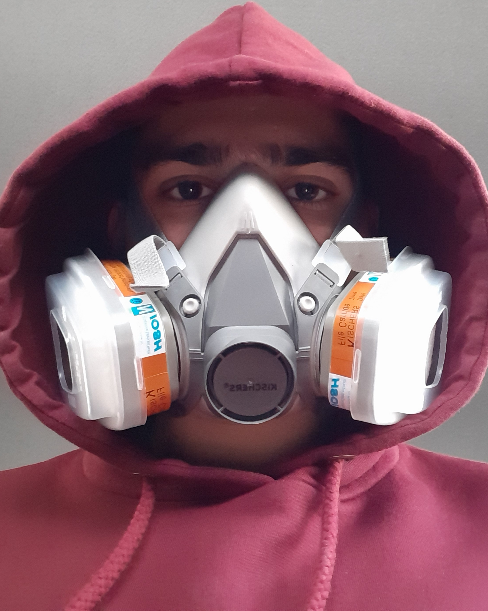

# **Artur Tsarukyan**



* **Mob. phone:**
  * +357 99 019146
* **E-mail:**
  * tsar.art@yahoo.com
* **Address:**
  * Magnisias St, Pafos, Cyprus

Welcome to my CV page and welcome! My name is Arthur, I won't hide it, I'm lazy. But I have to admit that I'm also stubborn. It is difficult to say from my positive or negative sides, but I can say for sure that I am diligent and until I achieve a result, I am unlikely to leave this case. And of the negative sides is to do everything at wish/mood.

There is no work experience in this field. Of the aspirations, I can single out the desire to enrich my knowledge in the web industry through practice and learning something new.

## **Skills:**

* HTML 5
* CSS 3
* JS
* Figma/Avocode

## **Code:**

```
function add(num1, num2) {
    num1 = num1.toString();
    num2 = num2.toString();

    while (num1.length < num2.length) {
        num1 = addZero(num1, num2);
    }
    while (num2.length < num1.length) {
        num2 = addZero(num2, num1);
    }

    let arr1 = num1.split(``),
        arr2 = num2.split(``),
        totalNum = [];
                
    for (let i = 0; i < arr1.length; i++) {
        let sum = +arr1[i] + +arr2[i];
            
        totalNum.push(String(sum));
    }

    return +totalNum.join(``);
}

function addZero(str1, str2) {
    while (str1.length < str2.length) {
        str1 = `0` + str1;
    }

    return str1;
}
```

## **Education:**

* RS School
* GeekBrains
* Code.mu
* UWE Bristol

## **Languages:**

* Russian
* English